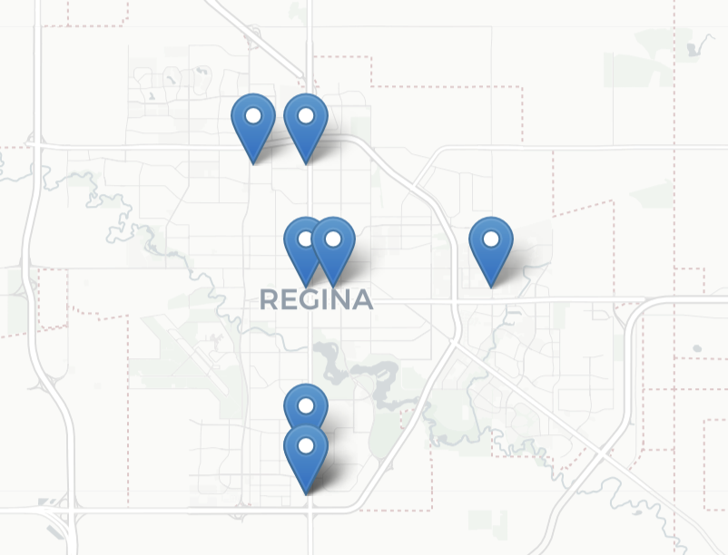

# Vehicle Routing Optimization

     

## Project Overview

In an era where transportation efficiency is paramount, optimizing truck routing is essential for reducing costs and improving service delivery. This project leverages the OpenRouteService API and advanced optimization techniques to analyze and enhance routing strategies for transportation analysts. By utilizing Python, Pandas, and Folium, we can extract, process, and visualize routing data effectively. The goal is to streamline logistics operations, improve route planning, and empower decision-makers with actionable insights.
### Dataset
This project uses a dataset based on Starbucks Worldwide locations. For the purpose of this project, we are considering the beautiful city of Regina. The dataset includes the following columns:

Link to the dataset: [Starbucks Locations Worldwide Dataset](https://www.kaggle.com/datasets/starbucks/store-locations)

- **Brand**: Brand name (e.g., Starbucks)
- **Store Number**: Unique identifier for the store
- **Store Name**: Name of the store
- **Ownership Type**: Type of ownership (e.g., Licensed)
- **Street Address**: Full street address of the store
- **City**: City where the store is located
- **State/Province**: State or province
- **Country**: Country
- **Postcode**: Postal code
- **Phone Number**: Contact number
- **Timezone**: Timezone of the store
- **Longitude**: Longitude coordinate
- **Latitude**: Latitude coordinate

#### Dataset: 

### Key Features

- **Interactive Mapping**: Visualize locations and routes on a map using Folium.
- **Route Optimization**: Use OpenRouteService to calculate the most efficient routes for multiple vehicles based on given service times.
- **Customizable Parameters**: Easily modify service times, vehicle capacities, and other parameters to fit specific requirements.

## Prerequisites

- Python 3.6 or higher
- Libraries: Folium, OpenRouteService, Pandas
- Access to OpenRouteService API (sign up for an API key)

## Steps

1. **Data Preparation**:
   The project begins by loading the coordinates and service times into a structured list.

2. **Mapping**:
   Folium is used to create an interactive map, where each location is marked with its corresponding service time, while we also set the start location.

#### Starbucks Locations at Regina

#### Setting Starting Point

3. **Route Optimization**:
   The OpenRouteService API is called to optimize the routes based on the defined vehicles and jobs. The response contains the optimized routes, which are then visualized on the map.

4. **Interactive Visualization**:
   The final map displays the optimized routes and provides information about arrival times for each job, allowing users to assess the efficiency of the planned routes.
#### Before setting service time and other factors:

As you can see one vehicle does only one location while the other does the rest which is not realistic

#### After Optimization with service time, jobs, shift time and other factors.

5. **Route Saved to Excel**:
   The routes for each vehicle are printed and saved in Excel for easy sharing.

## Conclusion: 

In conclusion, this Truck Routing Optimization Project illustrates the significant impact of data-driven strategies on enhancing transportation efficiency. By leveraging the OpenRouteService API and employing advanced optimization techniques, we have successfully streamlined routing processes, reducing operational costs and improving delivery times.

The integration of Python, Pandas, and Folium not only facilitated robust data analysis and visualization but also empowered transportation analysts with actionable insights. As logistics challenges continue to evolve, this project demonstrates the importance of adopting innovative solutions to optimize routes and ensure effective resource management.

Ultimately, our findings pave the way for more informed decision-making, enabling businesses to adapt to changing market dynamics while enhancing customer satisfaction through timely deliveries. As we look to the future, ongoing analysis and optimization will remain crucial for maintaining a competitive edge in the transportation sector.

